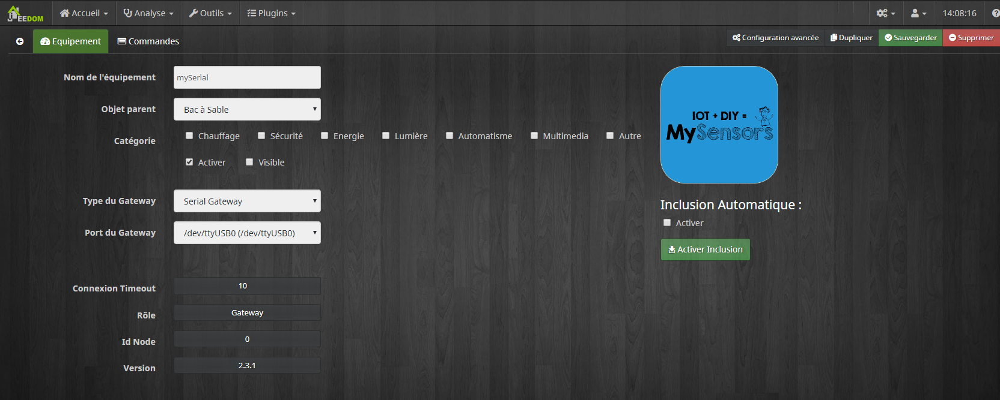

Description
===========

Ce plugin permet l’exploitation de modules mySensors par l’intermédiaire de
la solution domotique Jeedom.
Prise en charge du multi-gateway (Lan et Serial).

Introduction (sources wikipedia)
============

MySensors est un framework logiciel gratuit et open source de bricolage
destiné aux dispositifs IoT ( Internet des objets ) sans fil permettant aux 
dispositifs de communiquer à l'aide d' émetteurs radio.
La bibliothèque a été développée à l'origine pour la plateforme Arduino.

Les dispositifs MySensors créent un réseau radio virtuel de nœuds qui forme
automatiquement un maillage de type réparation automatique. Chaque nœud peut
relayer des messages pour que d'autres nœuds couvrent de plus grandes distances
à l'aide de simples émetteurs-récepteurs à courte portée. Chaque nœud peut avoir
plusieurs capteurs ou actionneurs connectés et peut interagir avec d'autres
nœuds du réseau.

Le réseau radio peut comporter jusqu'à 254 nœuds, un nœud pouvant servir de 
passerelle vers Internet ou de contrôleur domotique. Le contrôleur ajoute des
fonctionnalités au réseau radio, telles que l'attribution d'identifiant et
l'indication de l'heure.

Configuration du plugin
=======================

Après le téléchargement du plugin, il vous suffit de l’activer et de le
configurer.

Une fois activé, le démon devrait se lancer. Le plugin est préconfiguré
avec une valeur par défaut pour le port socket ; vous n’avez normalement plus
rien à faire. Cependant vous pouvez modifier cette configuration.

Log
---

Cette partie permet de choisir le niveau de log ainsi que d’en consulter
le contenu.

Sélectionner le niveau puis sauvegarder, le démon sera alors relancé
avec les instructions et traces sélectionnées.

Le niveau **Debug**ou**Info** peuvent être utiles pour comprendre
pourquoi le démon plante ou ne remonte pas une valeur.

> **Important**
>
> En mode **Debug** le démon est très verbeux, il est recommandé
> d’utiliser ce mode seulement si vous devez diagnostiquer un problème
> particulier. Il n’est pas recommandé de laisser tourner le démon en
> **Debug**en permanence, si on utilise une**SD-Card**. Une fois le
> debug terminé, il ne faut pas oublier de retourner sur un niveau moins
> élevé comme le niveau **Error** qui ne remonte que d’éventuelles
> erreurs.

Configuration des équipements
=============================

La configuration des équipements MySensors est accessible à partir du menu
plugin :

Ci-dessous un exemple d’une page du plugin MySensors (présentée avec
quelques équipements) :

> **Tip**
>
> Les équipements sont regroupés par gateway afin de facilité la présentation.

Général
-------

Vous retrouvez ici toute la configuration de votre équipement :

Pour un gateway
~~~~~~~~~~~~~~~

-   **Nom de l’équipement** : nom de votre Gateway MySensors.

-   **Objet parent** : indique l’objet parent auquel
    appartient l’équipement.

-   **Catégorie** : les catégories de l’équipement (il peut appartenir à
    plusieurs catégories).

-   **Activer** : permet de rendre votre équipement actif.

-   **Visible** : le rend visible sur le dashboard.

-   **Type du Gateway** : Permet de définir si le gateway est branché via le
    port usb (serial) ou via le réseau lan (ip).

-   **Port du Gateway** : Si "type du Gateway" = serial alors définir le port
    USB sur lequel il est raccordé.

-   **IP:PORT du gateway** : Si "type du Gateway" = Lan alors définir l'adresse
    ip et le port du gateway sous la forme 192.168.xxx.xxx:xxxx

-   **Connexion Timeout** : Détermine la durée en seconde au bout de laquelle
    le gateway est considéré comme inaccessible.

-   **Inclusion Automatique** : Permet d'activer l'inclusion au fil de l'eau,
    dès qu'un node est branché il est automatiquement remonté dans jeedom.
    Si la case est inactive l'inclusion se fait en appuyant sur le bouton 
    "Activer Inclusion".

> **Important**
>
> La suppression d’un gateway supprime définitivement l'ensemble des nodes et
> sensors attachés à ce gateway.

Pour un node/sensor
~~~~~~~~~~~~~~~

-   **Nom de l’équipement** : nom de votre Node OU Sensor MySensors.

-   **Objet parent** : indique l’objet parent auquel
    appartient l’équipement.

-   **Catégorie** : les catégories de l’équipement (il peut appartenir à
    plusieurs catégories).

-   **Activer** : permet de rendre votre équipement actif.

-   **Visible** : le rend visible sur le dashboard.

> **Tip**
>
> Les autres informations sont automatiquement remontées depuis le gateway.